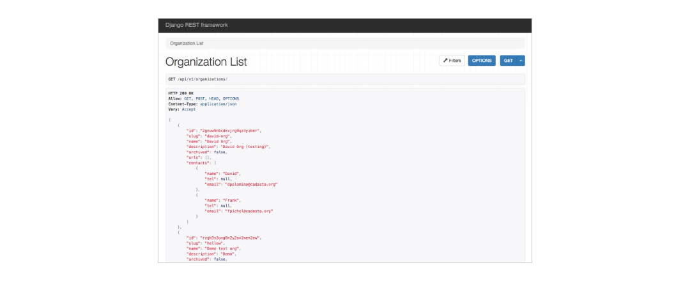
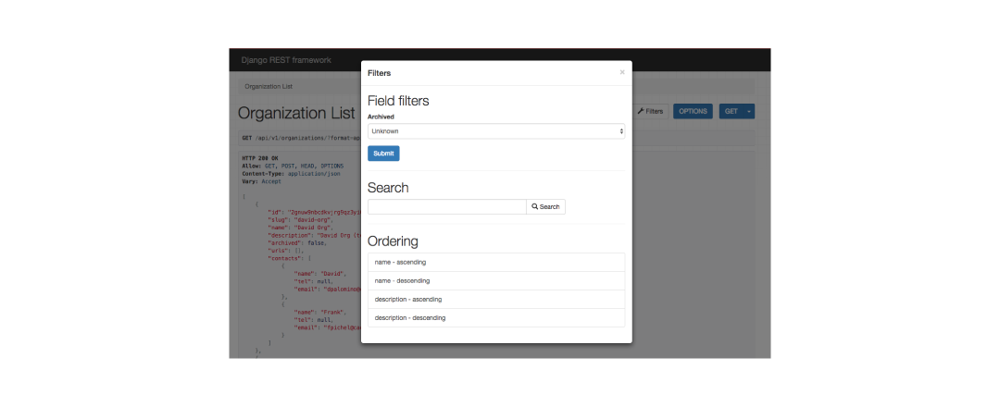
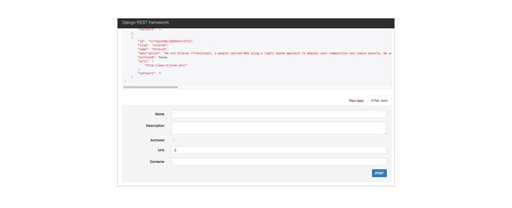
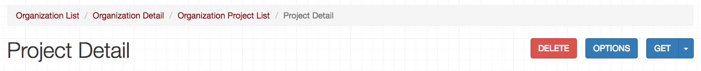
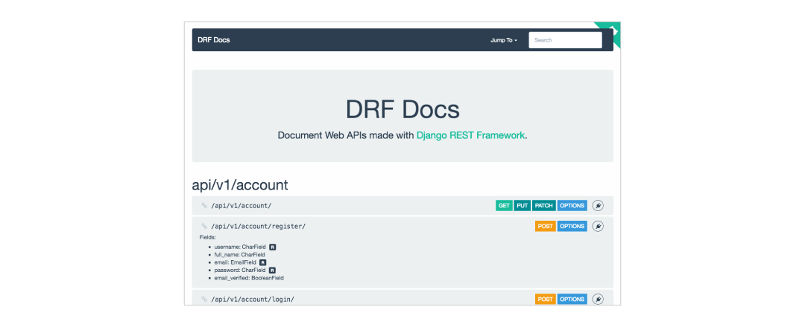
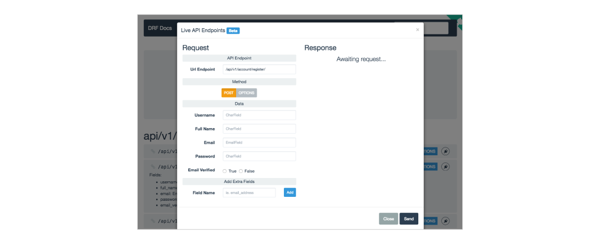
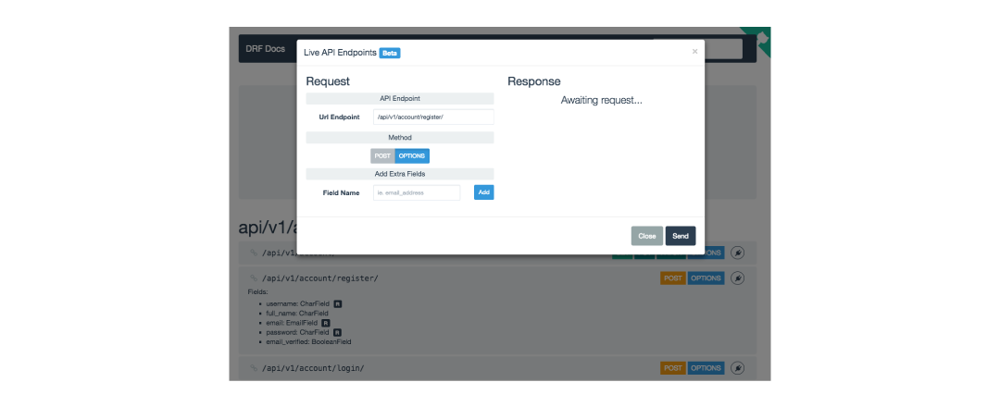

## Cadasta API documentation


Welcome to the Cadasta Platform API documentation. 

Using this platform API, you can: 

* Manage user [accounts](02-users.md) - creating them, deleting them, and amending them as needed; 
* Create and edit [organizations](03-organization.md); 
* View, create, and modify [projects](04-project.md) in the system, 
* Upload new [questionnaires](05-questionnaires.md), and
* Add, modify, and delete [project resources](07-resources.md) (including [spatial data](06-records.md)). 

> Beth We should add a bullet point + links to everything records (spatial units, parties, relationships)

Each of the sections listed above will outline how to use API endpoints to make these things happen.

## Topics

### Reading this Documentation

This documentation is structured primarily by related functionality and topic, and then by endpoint. 

Each endpoint is described using several parts:

* **The HTTP method.** The primary methods you'll see here are `GET`, `POST`, `PATCH`, and `DELETE`.

* **The path**, such as `/api/v1/organizations/{organization_slug}/projects/{project_slug}/spatial/`.

* **Any URL parameters**, a.k.a. parts of the endpoints wrapped in brackets. In the above path, those would be `{organization_slug}` and `{project_slug}`

In addition, each method + endpoint combination is described by a request payload, properties, and an example output. 

All URLs referenced here begin with the base path `https://platform-staging-api.cadasta.org`, which you put before the endpoint. If you're using a browser, the completed path will take you to the [API UI](#using-the-platform-api-ui), described below. 

> Beth Not sure about using the staging site as an example. The API docs should be generic and not pointing to a specific instance. Maybe we can rephrase this to "You have to prepend to the host name to the API examples." We could point to the demo site for users who want to explore the API. 


### Using the API

This API works best in one of two scenarios: 

1. **You're a developer working with an individual or organization using the Cadasta Platform.** If you have administrator access to the organization you're working for, you'll be able to perform many of the key functions for that organization using your [authorization token](#user-content-authentification). 

2. **You've created a locally-hosted version of the platform.** 

If you have any questions about using the API, please don't hesitate to [contact us](http://http://cadasta.org/contact/). 

### Using the Platform API UI

> Note that this section may be removed, as both of the interfaces are a bit confusing. However, at this time, the documents are written to work with these interfaces.

> Beth I agree, we should remove this and the next section. Maybe we can add a note in the introduction, where we point to this UI (we shouldn't point anyone to the DRF docs though) explaining that this is an easy way to explore the API, but this is an unsupported site and there might be some issues.

You can view each endpoint directly through the Cadasta Platform API. This API begins with the following base URL:

```
https://platform-staging-api.cadasta.org/
```

To get started, use this documentation to determine which endpoint you'd like to access. Then, add it to the end of the URL `https://platform-staging-api.cadasta.org/`. For example, to get to `api/v1/organizations/`, you'd write:

```
https://platform-staging-api.cadasta.org/api/v1/organizations/
```

The page you'll see looks like this:



Here you're seeing the output from the GET method - all of the publicly viewable organizations in the system. 

On the right, you can use the dropdown next to the GET button to select whether you'd like the API view or JSON. 


You can also select Filters, which will take you to a pop-up window where you can filter though results. 



POST methods are available at the bottom of the page. If you'd like to post a new organization, for example, you can scroll to the bottom of the page and add all the fields necessary to create a new organization using either the Raw Data or HTML form views. Submit the information by selecting POST. 

 

Last but not least, this API UI provides linked breadcrumbs at the top of the page. You can use these breadcrumbs to move backwards along the API paths. 

 

Take a moment to explore the following endpoint using the API interface:

```
https://platform-staging-api.cadasta.org/api/v1/organizations/
```

### Using DRF Docs

> Note that this section may be removed, as both of the interfaces are a bit confusing. However, at this time, the documents are written to work with these interfaces.

If you'd like an alternative UI view into the API, you can visit the documentation automatically created using Django REST Framework, or DRF Docs. You can visit that by going here:

https://platform-staging-api.cadasta.org/api/v1/docs/

To view the fields available for each endpoint, click either "Options" or the endpoint itself.



Now you can see that the following fields are available:

* `username`
* `full_name`
* `email`
* `password`
* `email_verified`

Fields with the square `R` next to them are required.

To register a new user here using the POST method, click the plugin symbol on the right. From there, you'll be taken to a pop-up window where you can register a new user. 



You can also select OPTIONS to add any needed additional fields.



When you're done, press Send. An `HTTP 200` message indicates that your data has been posted successfully.

Take a moment to explore any endpoint using DRF docs:

https://platform-staging-api.cadasta.org/api/v1/docs/

### Authentication / Authorization Tokens

One of the first things you need to do to get started is get an authorization token, which is required by most endpoints in the Cadasta API. You can obtain an authorization token by logging the user into the API.

To do this, see the documentation for [`/api/v1/account/login/`](#log-a-user-in) to see how to get an authentication token. 

Note that logging someone into the API does not log them into the platform.

### Permissions

Your authorization code will allow you to see content that you have access to: primarily your account, and organizations and projects that you create or administer. 

If you need access to information in someone else's account, contact them to get their username and password. From there, you can [log them into the API](02-users.md#user-content-log-a-user-in) to get their authorization token.

> Beth Users should never hand-over usernames an password to someone else. Getting access to another organization or project via the API works the same as it does on the platform: An organization admin grants specific rights ta a user. 

### Requests

All requests are encoded in `application/json`, unless they involve some kind of file upload. Any exceptions are indicated in the documentation.

### Common Response Codes

After submitting any API request, you'll get one of the following responses. 

Property | Description
---|---
`200` | The operation has been completed successfully
`400` | There was a problem with the request payload. Usually this means required attributes are missing or the values provided are not accepted. Only applies the `POST`, `PATCH` and `PUT` requests. 
`401` | No valid authentication token was provided with the request. 
`403` | Permission denied, the user has no permission to access this resource or perform this action. 
`404` | Not found. (The object with the given ID was not in the database.)

### Kinds of Fields

The type of fields being used are based in Django. If you're not sure how to use one of the field types documented, visit <a href="https://docs.djangoproject.com/en/1.10/ref/models/fields/#field-types" target="_blank">Django's documentation on Field Types</a>.

> Beth, this part is not necessary. We should document all information here in the API docs. Indicating the type of an attribute and if its required should be sufficient. Once we have the first draft of the docs ready, I'll go through and add some more special cases, like you can't use `new` or `add` as an org name. But that's nothing we should worry about at the moment. 

### Slugs

> Beth, Maybe we should rephase this a little, as this also applies to IDs for other objects. Maybe call this section "Accessing objects via URLs" or so.

To get at, create, or modify projects, organizations, organization members and more, you'll need to access a couple different kinds of slugs: 

* `organization_slug`, and 
* `project_slug`

You can find the `organization_slug` by locating the organization in the [list of all organziations](03-organization.md#user-content-list-organizations) and then copying the value of the `slug` property. 

You can find most `project_slugs` by [viewing all of the projects in the Cadasta system](03-organization.md#user-content-list-all-projects), which returns publicly viewable projects as well as projects you have access to. If it's a private project, you must have access to it and find it by [listing all of the projects in an organization](#user-content-list-all-projects-in-an-organization). 

Once you get your slugs, add them to your endpoint outside of the curly braces. 

For example, to get at a specific project, you need to use the following endpoint:

```endpoint
GET /api/v1/organizations/{organization_slug}/projects/{project_slug}/
```

If the `organization_slug` is `sample-organization` and the `project_slug` is `sample-project`, then the endpoint should look like this:

```
GET /api/v1/organizations/sample-organization/projects/sample-project/
```
