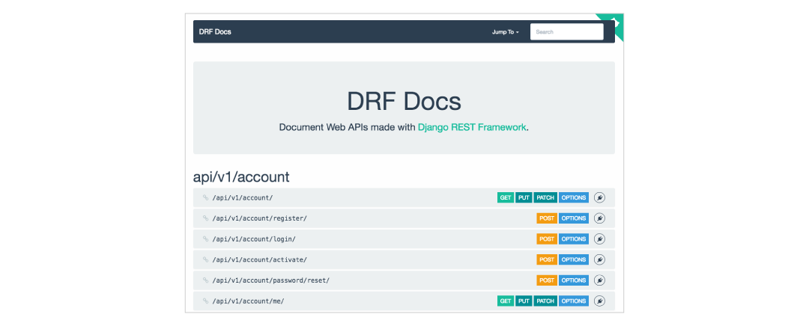

## Cadasta API documentation

Welcome to the Cadasta Platform API documentation! We're glad you found it. 

This documentation is intended for use alongside the Cadasta Platform API, which is a RESTful API using common HTTP methods. To access the API, visit:

https://platform-staging-api.cadasta.org/api/v1/docs/



This page uses Django REST Framework (a.k.a. DRF Docs) to show each API endpoint available, along with what kind of methods work with each one. For example, `/api/v1/account/register` can use the POST method. 

### Using DRF Docs

To view the fields available for each node, click either "Options" or the node itself.


Now you can see that the following fields are available:

* `username`
* `full_name`
* `email`
* `password`
* `email_verified`

Fields with the square `R` next to them are required.

To register a new user here using the POST method, click the plugin symbol on the right. From there, you'll be taken to a pop-up window where you can register a new user. 


You can also select OPTIONS to add any needed additional fields.


When you're done, press Send. An `HTTP 200` message indicates that your data has been posted successfully. 

### Using the Platform API

If you'd like an alternative view to DRF docs, then you can view each node directly throught the Cadasta Platform API. 

First, determine which endpoint you'd like to access. Then, add it to the end of the URL `https://platform-staging-api.cadasta.org/`. For example, to get to `api/v1/organizations/`, an endpoint that works with both GET and POST, you'd write:

```
https://platform-staging-api.cadasta.org/api/v1/organizations/
```

The page you'll see looks like this:


Here you're seeing the output from the GET method - all of the publicly viewable organizations in the system. 

On the right, you can use the dropdown next to the GET button to select whether you'd like the API view or JSON. 


You can also select Filters, which will take you to a pop-up window where you can filter though results. 


If you'd like to post a new organization, you can scroll to the bottom of the page. Here, you can add all the fields necessary to create a new organization. Submit the information by selecting POST. 


Both the DRF Docs and Platform API offer the same methods and options; the view that you use is up to you.