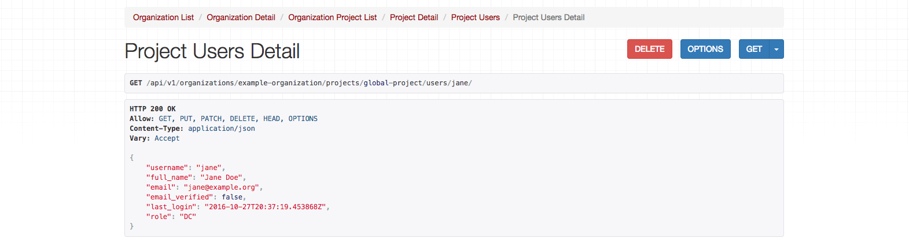

## Project

_To learn more about how questionnaires work, [see our documentation on Questionnaires & Custom Data Collection](https://docs.cadasta.org/en/08-XLSForms.html)._

The Cadasta API allows you work with data for <a href="https://docs.cadasta.org/en/03-projects.html" target="_blank">projects</a> that have been added to the platform. The two main endpoints you'll need to work with project data begin with:

```
GET /api/v1/projects/
```

and 

```endpoint
GET /api/v1/organizations/{organization_slug}/projects/
```

A project JSON object contains the following properties.

Property | Type | Description
---|---|---
`id` | CharField | The ID of the project
`organization` | OrganizationSerializer | [JSON object of the project's organization](03-organization.md#user-content-example-organization-json-object).
`country` | CountryField | The country where the project is located; represented as a two-letter [ISO 3166-1 alpha-2](https://en.wikipedia.org/wiki/ISO_3166-1_alpha-2) code.
`name` | CharField | The name of the project.
`description`| CharField | (optional) A long-form description of the project.
`archived` | BooleanField| `Boolean` indicating whether the project has be archived.
`urls` | ListField | A list of URLs to websites of this project.
`contacts` | JSONField | A list of contacts for this project. A contact is a JSON object containing `name`, `email` (optional) and `tel` (optional).
`users` | ListSerializer|  JSON Object of all the project's members // ADD LINK
`access` | ChoiceField | Indicates whether access to the project is restricted; is either `"public"` or `"private"`.
`slug` | SlugField | The short label of the project; usually used in URLs.


##### Example Project JSON Object

```json
{
  "id": "z82wdtrf8m9sh56bdph6qeig",
  "organization": {
    "id": "3r48bi5xy8xzfu5d94smpb7a",
    "slug": "example-organization",
    "name": "Example Organization",
    "description": "Example Organization is a non-profit, non-governmental organization working to empower poor and marginalized individuals and communities.",
    "archived": false,
    "urls": [
      "http://www.example.org/"
    ],
    "contacts": [
      {
        "tel": null,
        "name": "Andrew Brown",
        "email": "andrew@example.org"
      },
      {
        "tel": null,
        "name": "Megan Jones",
        "email": "megan@example.org"
      }
  ],
  "country": "NG",
  "name": "Lagos Tenure Assessment (old)",
  "description": "Security of Tenure Profiling in Lagos",
  "archived": false,
  "urls": [],
  "contacts": [],
  "access": "public",
  "slug": "lagos-tenure-assessment"
}
```

***


### List All Projects 

```endpoint
GET /api/v1/projects/
```

Use the above method to list all the publicly viewable projects in the Cadasta system. You can also see any private projects that you have access to.

**Request Payload**

No payload is required; simply a properly formatted endpoint.

**Response**

The response body is an array containing a [project JSON object](#user-content-example-project-json-object).

####Example Response

```json
[
    {
        "id": "pw6esdz94iztk4k23hskj73q",
        "organization": {
            "id": "rm4ahxqizjxqbzt3h8itmb3f",
            "slug": "brian-org",
            "name": "Brian Org",
            "description": "",
            "archived": false,
            "urls": [],
            "contacts": []
        },
        "country": "BD",
        "name": "Download Test",
        "description": "",
        "archived": false,
        "urls": [
            ""
        ],
        "contacts": [],
        "access": "public",
        "slug": "download-test"
    },
    {
        "id": "jugibdxzaz5i2v3uni5bt6d9",
        "organization": {
            "id": "rm4ahxqizjxqbzt3h8itmb3f",
            "slug": "brian-org",
            "name": "Brian Org",
            "description": "",
            "archived": false,
            "urls": [],
            "contacts": []
        },
        "country": "BD",
        "name": "Import Test",
        "description": "",
        "archived": false,
        "urls": [
            ""
        ],
        "contacts": [],
        "access": "public",
        "slug": "import-test-1"
    }
]


```

***


### List All Projects in an Organization

```endpoint
GET /api/v1/organizations/{organization_slug}/projects/
```

To see all of the projects in an organization, use the above method. 

This method also requires using an organization's slug. [Click here to learn about finding and formatting slugs](01-introduction.md#slugs). 

**Request Payload**

No payload required. Enter the URL for the organization in question to return all of the projects. 

**Response**

The response body is an array containing a [project JSON object](#user-content-example-project-json-object).

####Example Response

```json
[
    {
        "id": "h8ridjt2jazkac4e97srzmh2",
        "organization": {
            "id": "gae6pjf9xygxddgyg5dq45iq",
            "slug": "example-organization",
            "name": "Example Organization",
            "description": "",
            "archived": false,
            "urls": [
                "http://example.com"
            ],
            "contacts": null
        },
        "country": "",
        "name": "Atlanta Project",
        "description": "",
        "archived": false,
        "urls": [
            "http://www.atlanta-example.org"
        ],
        "contacts": null,
        "access": "public",
        "slug": "atlanta-project"
    },
    {
        "id": "hxk4k8aee5rh5htahhh5uenn",
        "organization": {
            "id": "gae6pjf9xygxddgyg5dq45iq",
            "slug": "example-organization",
            "name": "Example Organization",
            "description": "",
            "archived": false,
            "urls": [
                "http://example.com"
            ],
            "contacts": null
        },
        "country": "US",
        "name": "Portland Project",
        "description": "",
        "archived": false,
        "urls": [
            ""
        ],
        "contacts": [
            {
                "name": "Kate",
                "email": "kate@example.org",
                "tel": null
            },
            {
                "name": "Oliver",
                "email": "oliver@example.org",
                "tel": "444-555-6789"
            },
            {
                "name": "David",
                "email": null,
                "tel": "555-555-5555"
            }
        ],
        "access": "public",
        "slug": "portland-project"
    }
]

```

***


### Create a New Project


```endpoint
POST /api/v1/organizations/{organization_slug}/projects/
```
Use the above endpoint to create a new project. Note that all projects must be connected to an organization!

This also requires using an organization's slug. [Click here to learn about finding and formatting slugs](01-introduction.md#slugs). 


**Request Payload**

Property | Type | Required? | Description 
--- | --- | :---: | --- 
`country` | CountryField | x | The country where the project is located; represented as a two-letter [ISO 3166-1 alpha-2](https://en.wikipedia.org/wiki/
`name` | CharField | x | The name of the project.
`description` | CharField |  | A long-form description of the project.
`archived` | BooleanField | x | Indicates whether the project has be archived.
`urls` | ListField | x | A list of URLs to websites of this project.
`contacts` | JSONField |  | A list of contacts for this project. A contact is a JSON object containing `name`, `email` (optional) and `tel` (optional).
`access` | ChoiceField | x | Indicates whether the project is a public or a private one. 

**Response**

The response body is an array containing a [project JSON object](#user-content-example-project-json-object).

####Example Response

```
[
    {
        "id": "h8ridjt2jazkac4e97srzmh2",
        "organization": {
            "id": "gae6pjf9xygxddgyg5dq45iq",
            "slug": "example-organization",
            "name": "Example Organization",
            "description": "",
            "archived": false,
            "urls": [
                "http://example.com"
            ],
            "contacts": null
        },
        "country": "",
        "name": "Atlanta Project",
        "description": "",
        "archived": false,
        "urls": [
            "http://www.atlanta-example.org"
        ],
        "contacts": null,
        "access": "public",
        "slug": "atlanta-project"
    },
    {
        "id": "hxk4k8aee5rh5htahhh5uenn",
        "organization": {
            "id": "gae6pjf9xygxddgyg5dq45iq",
            "slug": "example-organization",
            "name": "Example Organization",
            "description": "",
            "archived": false,
            "urls": [
                "http://example.com"
            ],
            "contacts": null
        },
        "country": "US",
        "name": "Portland Project",
        "description": "",
        "archived": false,
        "urls": [
            ""
        ],
        "contacts": [
            {
                "name": "Kate",
                "tel": null,
                "email": "kate@example.org"
            },
            {
                "name": "Oliver",
                "tel": "444-555-6789",
                "email": "oliver@example.org"
            },
            {
                "name": "David",
                "tel": "555-555-5555",
                "email": null
            }
        ],
        "access": "public",
        "slug": "global-project"
    }
]
```


### Get a Project

```endpoint
GET /api/v1/organizations/{organization_slug}/projects/{project_slug}/
```

Use this method to get at a specific project. 

This method requires using both an organization and a project slug. [Click here to learn about finding and formatting slugs](01-introduction.md#slugs). 

**Request Payload**

No payload, only a properly formatted endpoint.

**Response**

The response body is an array containing a [project JSON object](#user-content-example-project-json-object).


#### Example Response

```json
{
    "id": "hxk4k8aee5rh5htahhh5uenn",
    "organization": {
        "id": "gae6pjf9xygxddgyg5dq45iq",
        "slug": "example-organization",
        "name": "Example Organization",
        "description": "",
        "archived": false,
        "urls": [
            "http://example.com"
        ],
        "contacts": null
    },
    "country": "US",
    "name": "Portland Project",
    "description": "",
    "archived": false,
    "urls": [
        ""
    ],
    "contacts": [
        {
            "name": "Kate",
            "email": "kate@example.org",
            "tel": null
        },
        {
            "name": "Oliver",
            "email": "oliver@example.org",
            "tel": "444-555-6789"
        },
        {
            "name": "David",
            "email": null,
            "tel": "555-555-5555"
        }
    ],
    "users": [],
    "access": "public",
    "slug": "global-project"
}
```


### Update Basic Project Information

```endpoint
PATCH /api/v1/organizations/{organization_slug}/projects/{project_slug}/
```

Use the above method to update a project in an organization. The fields of the project that you can edit are shown in the request payload below. 


**Request Payload**

Using the API, you can update any of the following fields. All of them are optional; fields left blank will remain the same following the PATCH method.

Property | Type | Required? | Description 
--- | --- | :---: | --- 
`country` | CountryField | | The country where the project is located; represented as a two-letter [ISO 3166-1 alpha-2](https://en.wikipedia.org/wiki/ISO_3166-1_alpha-2) code.
`name` | CharField | | The name of the project.
`description`| CharField | | (optional) A long-form description of the project.
`archived` | BooleanField| | `Boolean` indicating whether the project has be archived.
`urls` | ListField | | A list of URLs to websites of this project.
`contacts` | JSONField | | A list of contacts for this project. A contact is a JSON object containing `name`, `email` (optional) and `tel` (optional).
`access` | ChoiceField | | Indicates whether access to the project is restricted; is either `"public"` or `"private"`.

**Response**

The response body is an array containing a [project JSON object](#user-content-example-project-json-object).

#### Example Response

```json
{
    "id": "hxk4k8aee5rh5htahhh5uenn",
    "organization": {
        "id": "gae6pjf9xygxddgyg5dq45iq",
        "slug": "example-organization",
        "name": "Example Organization",
        "description": "",
        "archived": false,
        "urls": [
            "http://example.com"
        ],
        "contacts": null
    },
    "country": "US",
    "name": "Portland Project",
    "description": "",
    "archived": false,
    "urls": [
        ""
    ],
    "contacts": [
        {
            "name": "Kate",
            "email": "kate@example.org",
            "tel": null
        },
        {
            "name": "Oliver",
            "email": "oliver@example.org",
            "tel": "444-555-6789"
        },
        {
            "name": "David",
            "email": null,
            "tel": "555-555-5555"
        }
    ],
    "users": [
        {
            "username": "dpalomino",
            "full_name": "David Palomino",
            "email": "dpalomino@example.org",
            "email_verified": true,
            "last_login": "2016-10-24T14:46:56.317086Z"
        },
        {
            "username": "kate",
            "full_name": "Kate",
            "email": "kate@example.org",
            "email_verified": false,
            "last_login": "2016-10-21T11:00:46.182648Z"
        }
    ],
    "access": "public",
    "slug": "portland-project"
}

```


## Project Members

Project members are users associated with projects in the Cadasta Platform. Using the Cadasta API, you can add, view, update, and delete project members.

The endpoint for project member objects start with:

```
/api/v1/organizations/example-organization/projects/global-project/users/
```

A project member JSON object contains the following properties:

Property | Type | Required? | Description
---|---|:---:|---
`username` | CharField | x |The user's username (30 characters or fewer. Letters, digits and @/./+/-/_ only.)
`full_name` | CharField | | The user's full name. (optional)
`email` | EmailField | | The user's email address.
`email_verified` | BooleanField | | Boolean indicating whether the user has verified their email address.
`last_login` | DateTimeField | |  Date and time of last user login.
`role` | CharField | x | Indicates the role of the user on the project. (PM = Project manager, DC = Data Collector)

> Note: apparently only being able to see PMs and DCs is a bug; Beth to update these docs once that is fixed.

##### Example Project Member JSON Object

```json
{
    "username": "kate",
    "full_name": "Kate",
    "email": "kate@example.org",
    "email_verified": false,
    "last_login": "2016-10-21T11:00:46.182648Z",
    "role": "PM"
}
```

### List Project Members

```endpoint
GET /api/v1/organizations/{organization_slug}/projects/{project_slug}/users/
```

Use the above method see the members of a project, specifically the Project Managers (PMs) and Data Collectors (DCs). 

Note that Project Administrators are not listed, nor are Public Users. 

**Request Payload**

No request payload; only a properly formatted endpoint.

**Response**

The response contains a JSON object with the following properties:

Property | Type | Description
---|---|---
`username` | CharField |The user's username (30 characters or fewer. Letters, digits and @/./+/-/_ only.)
`full_name` | CharField| The user's full name. (optional)
`email` | EmailField | The user's email address.
`email_verified` | BooleanField|Boolean indicating whether the user has verified their email address.
`last_login` | DateTimeField | Date and time of last user login.
`role` | CharField | Indicates the role of the user on the project. (PM = Project manager, DC = Data Collector)

####Example Response

```json
[
    {
        "username": "dpalomino",
        "full_name": "David Palomino",
        "email": "dpalomino@example.org",
        "email_verified": true,
        "last_login": "2016-10-24T14:46:56.317086Z",
        "role": "DC"
    },
    {
        "username": "kate",
        "full_name": "Kate",
        "email": "kate@example.org",
        "email_verified": false,
        "last_login": "2016-10-21T11:00:46.182648Z",
        "role": "PM"
    }
]
```


### Add a Project Member

> NOTE: should be able to see Public User and Administrator; bug being fixed.

```endpoint
POST /api/v1/organizations/{organization_slug}/projects/{project_slug}/users/
```

Use the above method to add a new project member to a project. 

Note that project members need to already have a user account and be a member of the organization administering the project. 

_Learn more about [creating user accounts](02_users.md#user-content-register-a-new-user--create-a-new-user-account) and [adding organization members](03-organizations.md#user-content-add-an-organization-member)._


**Request Payload**

Property | Type | Required? | Description 
--- | --- | :---: | --- 
`username` | CharField | x | The user's username (30 characters or fewer. Letters, digits and @/./+/-/_ only.)
`role` | CharField | x | Indicates the role of the user on the project. (PM = Project manager, DC = Data Collector)

**Response**

The response contains a JSON object with the following properties:

Property | Type | Description
---|---|---
`username` | CharField |The user's username (30 characters or fewer. Letters, digits and @/./+/-/_ only.)
`full_name` | CharField| The user's full name. (optional)
`email` | EmailField | The user's email address.
`email_verified` | BooleanField|Boolean indicating whether the user has verified their email address.
`last_login` | DateTimeField | Date and time of last user login.
`role` | CharField | Indicates the role of the user on the project. (PM = Project manager, DC = Data Collector)


####Example Response

```json
{
    "username": "jane",
    "full_name": "Jane Doe",
    "email": "jane@example.org",
    "email_verified": false,
    "last_login": "2016-10-27T20:37:19.453868Z",
    "role": "DC"
}
```


### Get a Project Member

```endpoint
GET /api/v1/organizations/{organization_slug}/projects/{project_slug}/users/{username}/
```

Use the above method to see a member of a project. This can be helpful if you need to see or change their role in the project.

**Request Payload**

> NOTE: should be able to see Public User and Administrator as options in the `role` field; bug being fixed.

Property | Type | Required? | Description 
--- | --- | :---: | --- 
`username` | CharField | x | The user's username (30 characters or fewer. Letters, digits and @/./+/-/_ only.)
`role` | CharField | x | Indicates the role of the user on the project. (PM = Project manager, DC = Data Collector)

> Beth to update `role` once bug is fixed. 

**Response**

The response contains a JSON object with the following properties:

Property | Type | Description
---|---|---
`username` | CharField |The user's username (30 characters or fewer. Letters, digits and @/./+/-/_ only.)
`full_name` | CharField| The user's full name. (optional)
`email` | EmailField | The user's email address.
`email_verified` | BooleanField|Boolean indicating whether the user has verified their email address.
`last_login` | DateTimeField | Date and time of last user login.
`role` | CharField | Indicates the role of the user on the project. (PM = Project manager, DC = Data Collector)

####Example Response

```json
{
    "username": "jane",
    "full_name": "Jane Doe",
    "email": "jane@example.org",
    "email_verified": false,
    "last_login": "2016-10-27T20:37:19.453868Z",
    "role": "DC"
}
```


### Update Project Member Permissions

> getting a platform error; fill in content when error is resolved.

```endpoint
PATCH /api/v1/organizations/{organization_slug}/projects/{project_slug}/users/{username}/
```

This method allows you to update the permissions granted to a project member. You can select one of the following permissions:

ID | Title
---|---
DC | Data Collector
PM | Project Manager

**Request Payload**

> NOTE: should be able to see Public User and Administrator in the `role` field; bug being fixed.

Property | Type | Required? | Description 
--- | --- | :---: | --- 
`username` | CharField | x | The user's username (30 characters or fewer. Letters, digits and @/./+/-/_ only.)
`role` | CharField | x | Indicates the role of the user on the project. (PM = Project manager, DC = Data Collector)

**Response**

> fill in when I'm not getting an error


####Example Response

> fill in when I'm not getting an error


### Remove a Project Member

```endpoint
DELETE /api/v1/organizations/{organization_slug}/projects/{project_slug}/users/{username}/
```

The above method removes a member from a project. 

**Request Payload**

No payload required. Pressing the **Delete** button from the API UI will delete the member.



**Response**

Response will be in the form of a response code. An `HTTP 204 No Content` indicates that there is no longer content in the project associated with that username, meaning their information has been removed.

If there's an error, then you'll get an error message or another [response code](01-introduction.md#user-content-common-response-codes). 
####Example Response

```response
HTTP 204 No Content
Allow: GET, PUT, PATCH, DELETE, HEAD, OPTIONS
Content-Type: application/json
Vary: Accept
```

***


