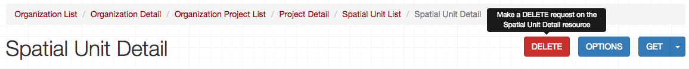

## Spatial Units (a.k.a Project Locations)

> Questions for Oliver:
* Should we call these Spatial Units or Project Locations? They're called Project Locations in the docs and on the platform, so I'm inclined to go that route. Are they called Spatial Units for a reason?
* I'm noticing that spatical unit / project locations are sometimes structured differently than they are in this introduction. Would love to talk through that with you to make sure I understand.

Projects in the Cadasta Platform are spatial in nature – collections of points, lines, and polygons representing areas where land rights documentation is happening. These points, lines, and polygons can be retrieved and modified using the Cadasta API.  

_<a href="https://docs.cadasta.org/en/04-records.html#project-locations" target="_blank">Read more about Project Locations in our Platform Documentation</a>_

The endpoint you need to access JSON for spatial units / project locations starts like this:

```
/api/v1/organizations/{organization_slug}/projects/{project_slug}/spatial/
```

A spatial unit / project location object is structured like this:

> edit based on a single unit

* `type`: ChoiceField (set automatically to `FeatureCollection`)
* `features` 
	* `type`: ChoiceField (set automatically to `Feature`)
	* `geometry`: GeometryField
		* `type`: ChoiceField (whether the feature is a `point`, `line `or `polygon`)
		* `coordinates` (contains an array of GPS coordinates)
	* `properties`
		* `id`: CharField
		* `type`: ChoiceField (the type of location it is, e.g. `PA` for Parcel)
		* `attributes`: JSONField

Its JSON object contains the following properties: 

Property | Type | Description
---|---|---
`type` | ChoiceField | This field is automatically set to Feature.
`geometry` | GeometryField | An object defining whether the location is recorded as a point, line, or polygon, as well as coordinates that make it up. (See the `geometry` table below for more information.)   
`properties` | ?? | An object that gives the location a unique ID, defines the type of location it is (land `types`), and lists any attributes. (See  the `properties` table below for more information)

Each object in `geometry` contains the following properties: 

Property | Type | Description
---|---|---
`type` | ?? | Indicates the geometry type: a `point`, `line`, or `polygon`.
`coordinates` | ?? | An array of all the GPS coordinates that make up the geometry of the spatial unit

Each object in `properties` contains the following properties:

Property | Type | Description
---|---|---
`id` | CharField | A unique ID for the spatial unit
`type` | ChoiceField | The type of spatial unit that it is, defined by the fields in your questionnaire. (See the land `types` table below )
`attributes` | JSONField | (Optional) An array of different attributes for the property. 

> Oliver, `attributes` looks like an object, but I don't see any listed as an example. How are these objects structured? 

If you need to plot out the land `types`, these are the abbreviations you need:

Abbreviation | What it Represents
`PA` | Parcel
`CB` | Community Boundary
`BU` | Building
`AP` | Apartment
`PX` | Project Extent
`RW` | Right-of-way
`NP` | National Park Boundary
`MI` | Miscellaneous


#### Example Spatial Unit in a Project (a.k.a Project Locations)

```json

{
    "type": "Feature",
    "geometry": {
        "type": "Polygon",
        "coordinates": [
            [
                [
                    -122.7457809448242,
                    45.64344809984393
                ],
                [
                    -122.7308464050293,
                    45.640807770704704
                ],
                [
                    -122.71333694458006,
                    45.63456649809911
                ],
                [
                    -122.68827438354492,
                    45.62328243346257
                ],
                [
                    -122.66819000244142,
                    45.61463778373898
                ],
                [
                    -122.64501571655272,
                    45.60479086492599
                ],
                [
                    -122.64656066894531,
                    45.602869313350624
                ],
                [
                    -122.65205383300781,
                    45.60226881498576
                ],
                [
                    -122.67093658447266,
                    45.60310951089689
                ],
                [
                    -122.6905059814453,
                    45.6092342008613
                ],
                [
                    -122.71368026733398,
                    45.61956059488118
                ],
                [
                    -122.72998809814452,
                    45.62940492064501
                ],
                [
                    -122.74543762207031,
                    45.64068775278732
                ],
                [
                    -122.7457809448242,
                    45.64344809984393
                ]
            ]
        ]
    },
    "properties": {
        "id": "xtc4de68iawwzgtawp8avgv8",
        "type": "PA",
        "attributes": {}
    }
}

```


### List Spatial Units / Project Locations

```endpoint
GET /api/v1/organizations/{organization_slug}/projects/{project_slug}/spatial/
```

Use the above method to get the GPS coordinates for all of the locations in a spatial unit / project location. These coordinates may be shown as a point, line or polygon.

**Request Payload**

No payload required; only a properly formatted endpoint.

**Response**

The response body is a JSON object containing multiple [project location / spatial unit JSON objects](#user-content-example-spatial-units-in-a-project-aka-project-locations). Encasing these objects are the following properties:

Property | Type | Description
---|---|---
`type` | ChoiceField | This field is automatically set to FeatureCollection.
`features` | ?? | Creates an array of all of the [project location / spatial unit JSON objects](#user-content-example-spatial-units-in-a-project-aka-project-locations) in the project. 


####Example Response

{
    "type": "FeatureCollection",
    "features": [
        {
            "type": "Feature",
            "geometry": {
                "type": "Polygon",
                "coordinates": [
                    [
                        [
                            -122.7457809448242,
                            45.64344809984393
                        ],
                        [
                            -122.7308464050293,
                            45.640807770704704
                        ],
                        [
                            -122.71333694458006,
                            45.63456649809911
                        ],
                        [
                            -122.68827438354492,
                            45.62328243346257
                        ],
                        [
                            -122.66819000244142,
                            45.61463778373898
                        ],
                        [
                            -122.64501571655272,
                            45.60479086492599
                        ],
                        [
                            -122.64656066894531,
                            45.602869313350624
                        ],
                        [
                            -122.65205383300781,
                            45.60226881498576
                        ],
                        [
                            -122.67093658447266,
                            45.60310951089689
                        ],
                        [
                            -122.6905059814453,
                            45.6092342008613
                        ],
                        [
                            -122.71368026733398,
                            45.61956059488118
                        ],
                        [
                            -122.72998809814452,
                            45.62940492064501
                        ],
                        [
                            -122.74543762207031,
                            45.64068775278732
                        ],
                        [
                            -122.7457809448242,
                            45.64344809984393
                        ]
                    ]
                ]
            },
            "properties": {
                "id": "xtc4de68iawwzgtawp8avgv8",
                "type": "PA",
                "attributes": {}
            }
        },
        {
            "type": "Feature",
            "geometry": {
                "type": "Polygon",
                "coordinates": [
                    [
                        [
                            -122.66475677490233,
                            45.50045162361647
                        ],
                        [
                            -122.66956329345703,
                            45.487395598055215
                        ],
                        [
                            -122.66750335693358,
                            45.481739052946516
                        ],
                        [
                            -122.66441345214844,
                            45.47903093138234
                        ],
                        [
                            -122.66372680664062,
                            45.47668378740375
                        ],
                        [
                            -122.6597785949707,
                            45.47710507685561
                        ],
                        [
                            -122.65746116638182,
                            45.47860965632908
                        ],
                        [
                            -122.654972076416,
                            45.482641731208865
                        ],
                        [
                            -122.65402793884277,
                            45.48613195107752
                        ],
                        [
                            -122.65445709228516,
                            45.48865921668583
                        ],
                        [
                            -122.65780448913574,
                            45.49052450666501
                        ],
                        [
                            -122.66063690185547,
                            45.493352409132655
                        ],
                        [
                            -122.66218185424803,
                            45.497443591159865
                        ],
                        [
                            -122.66252517700195,
                            45.49954923075264
                        ],
                        [
                            -122.66475677490233,
                            45.50045162361647
                        ]
                    ]
                ]
            },
            "properties": {
                "id": "39jvd8r93jijahnvgd4s4cih",
                "type": "PA",
                "attributes": {}
            }
        }
    ]
}


***


### Create a New Spatial Unit / Project Location


```endpoint
POST /api/v1/organizations/{organization_slug}/projects/{project_slug}/spatial/
```

Use the above method to create a new spatial unit / project location.

**Request Payload**

Property | Type | Required? | Description 
--- | --- | :---: | --- 
`geometry` | GeometryField | x | An object defining whether the location is recorded as a point, line, or polygon, as well as coordinates that make it up. (See the `geometry` table below for more information.)  
`type` | ChoiceField | x | This refers to the possible land `types` that the location could be (e.g. `PA` = Parcel). See the land `types` table above for more information.
`attributes` | JSONField |  | An array of different attributes for the property. 

Formatting your geometry can be a little tricky. Here are some examples to help you out. 

To format a **point**, write:

```json
geometry: {"type": "Point", "coordinates": [-122.7457809448242, 45.64344809984393]}
```
> Oliver, is `LineString` the correct thing to use here? `Line` didn't work, but in the GeoJSON docs I found LineString

To format a **line**, write:

```json
"geometry": {"type": "LineString", "coordinates": [ [-122.7457809448242, 45.64344809984393 ], [-122.7457809448235, 45.64344809984393 ], [-122.7457809448219, 45.64344809984393 ] ] }
```

To format a **polygon**, write the following:

```json
"geometry": {"type": "Polygon", "coordinates": [ [ [-122.7457809448242, 45.64344809984393 ], [-122.7457809448235, 45.64344809984442 ], [-122.7457809448219, 45.64344809984999 ], [-122.7457809448242, 45.64344809984393 ] ] ] }

```

For polygons, make sure that the last coordinate is the same as the first.

Note that the main difference between the formatting examples above is the number of brackets, and the selection of `Point`, `LineString` or `Polygon` as the `type`.


**Response**

>For this, does it work to just have the outline rather than a table?

The response is a JSON Object with the following properties:

* `type`: ChoiceField (set automatically to `Feature`)
* `geometry`: GeometryField
    * `type`: ChoiceField (whether the feature is a `point`, `line `or `polygon`)
    * `coordinates` (the coordinates that make up the geometry)
* `properties`
    * `id`: CharField (the unique ID for the spatial unit / project location)
    * `type`: ChoiceField (the type of location it is; e.g. `PA` for Parcel)
    * `attributes`: ChoiceField (Optional)
    * `project`: NestedProjectSerializer
        * `id`: CharField (the ID of the project)
        * `organization`: OrganizationSerializer
            * `id`: CharField (the ID of the organization)
            * `slug`: SlugField (organization slug)
            * `name`: CharField (organization name)
        * `name`: CharField (project name)
        * `slug`: SlugField (project slug)

```


####Example Response

```json
{
    "type": "Feature",
    "geometry": {
        "type": "Point",
        "coordinates": [
            -122.7457809448242,
            45.64344809984393
        ]
    },
    "properties": {
        "id": "n776cwdhqriaqdwsfafiajib",
        "type": "MI",
        "attributes": {},
        "project": {
            "id": "hxk4k8aee5rh5htahhh5uenn",
            "organization": {
                "id": "gae6pjf9xygxddgyg5dq45iq",
                "slug": "example-organization",
                "name": "Example Organization"
            },
            "name": "Portland Project",
            "slug": "global-project"
        }
    }
}

```

***


### Get a Spatial Unit / Project Location

```endpoint
GET /api/v1/organizations/{organization_slug}/projects/{project_slug}/spatial/{spatial_unit_id}/
```

Use the above method to get the JSON object for a specific spatial unit / project location. 

The endpoint requires the `id` of the unit, which you can find by [listing all of the spatial units](#user-content-list-spatial-units) for the project it's in. The ID will look something like this:

```
"id": "39jvd8r93jijahnvgd4s4cih",
```

So the endpoint you need should look something like this:

```
/api/v1/organizations/example-organization/projects/global-project/spatial/39jvd8r93jijahnvgd4s4cih/
```

**Request Payload**

No payload required; only a properly formatted endpoint.

**Response**

The response contains a JSON object with the following structure:

> Not sure the type of field for `coordinates` and `properties`

> Also, for this, does it work to just have the outline rather than a table?

* `type`: ChoiceField (set automatically to `Feature`)
* `geometry`: GeometryField
    * `type`: ChoiceField (whether the feature is a `point`, `line `or `polygon`)
    * `coordinates` (the coordinates that make up the geometry)
* `properties`
    * `id`: CharField (the unique ID for the spatial unit / project location)
    * `type`: ChoiceField (the type of location it is; e.g. `PA` for Parcel)
    * `attributes`: ChoiceField (Optional)
    * `project`: NestedProjectSerializer
        * `id`: CharField (the ID of the project)
        * `organization`: OrganizationSerializer
            * `id`: CharField (the ID of the organization)
            * `slug`: SlugField (organization slug)
            * `name`: CharField (organization name)
        * `name`: CharField (project name)
        * `slug`: SlugField (project slug)


####Example Response

```json
{
    "type": "Feature",
    "geometry": {
        "type": "Polygon",
        "coordinates": [
            [
                [
                    -122.66475677490233,
                    45.50045162361647
                ],
                [
                    -122.66956329345703,
                    45.487395598055215
                ],
                [
                    -122.66750335693358,
                    45.481739052946516
                ],
                [
                    -122.66441345214844,
                    45.47903093138234
                ],
                [
                    -122.66372680664062,
                    45.47668378740375
                ],
                [
                    -122.6597785949707,
                    45.47710507685561
                ],
                [
                    -122.65746116638182,
                    45.47860965632908
                ],
                [
                    -122.654972076416,
                    45.482641731208865
                ],
                [
                    -122.65402793884277,
                    45.48613195107752
                ],
                [
                    -122.65445709228516,
                    45.48865921668583
                ],
                [
                    -122.65780448913574,
                    45.49052450666501
                ],
                [
                    -122.66063690185547,
                    45.493352409132655
                ],
                [
                    -122.66218185424803,
                    45.497443591159865
                ],
                [
                    -122.66252517700195,
                    45.49954923075264
                ],
                [
                    -122.66475677490233,
                    45.50045162361647
                ]
            ]
        ]
    },
    "properties": {
        "id": "39jvd8r93jijahnvgd4s4cih",
        "type": "PA",
        "attributes": {},
        "project": {
            "id": "hxk4k8aee5rh5htahhh5uenn",
            "organization": {
                "id": "gae6pjf9xygxddgyg5dq45iq",
                "slug": "example-organization",
                "name": "Example Organization"
            },
            "name": "Portland Project",
            "slug": "portland-project"
        }
    }
}
```

***


### Update a Spatial Unit

> Oliver, PATCH does not seem to be working with geometry / coordinates, only with `type`. Have not tried modifying `attributes`, as I'm not sure what goes there.

```endpoint
PATCH /api/v1/organizations/{organization_slug}/projects/{project_slug}/spatial/{spatial_unit_id}/
```

Use the above method to update the JSON object for a specific spatial unit / project location. 

The endpoint requires the `id` of the unit, which you can find by [listing all of the spatial units](#user-content-list-spatial-units) for the project it's in. The ID will look something like this:

```
"id": "39jvd8r93jijahnvgd4s4cih",
```

So the endpoint you need should look something like this:

```
/api/v1/organizations/example-organization/projects/global-project/spatial/39jvd8r93jijahnvgd4s4cih/
```

**Request Payload**

Property | Type | Required? | Description 
--- | --- | :---: | --- 
`geometry` | GeometryField | x | An object defining whether the location is recorded as a point, line, or polygon, as well as coordinates that make it up. (See the `geometry` table below for more information.)  
`type` | ChoiceField | x | This refers to the possible land `types` that the location could be (e.g. `PA` = Parcel). See the land `types` table above for more information.
`attributes` | JSONField |  | An array of different attributes for the property. 

Formatting your geometry can be a little tricky. Here are some examples to help you out. 

To format a **point**, write:

```json
geometry: {"type": "Point", "coordinates": [-122.7457809448242, 45.64344809984393]}
```
> Oliver, is `LineString` the correct thing to use here? `Line` didn't work, but in the GeoJSON docs I found LineString

To format a **line**, write:

```json
"geometry": {"type": "LineString", "coordinates": [ [-122.7457809448242, 45.64344809984393 ], [-122.7457809448235, 45.64344809984393 ], [-122.7457809448219, 45.64344809984393 ] ] }
```

To format a **polygon**, write the following:

```json
"geometry": {"type": "Polygon", "coordinates": [ [ [-122.7457809448242, 45.64344809984393 ], [-122.7457809448235, 45.64344809984442 ], [-122.7457809448219, 45.64344809984999 ], [-122.7457809448242, 45.64344809984393 ] ] ] }

```

For polygons, make sure that the last coordinate is the same as the first.

Note that the main difference between the formatting examples above is the number of brackets, and the selection of `Point`, `LineString` or `Polygon` as the `type`.

**Response**

The response contains a JSON object with the following structure:

> Not sure the type of field for `coordinates` and `properties`

> Also, for this, does it work to just have the outline rather than a table?

* `type`: ChoiceField (set automatically to `Feature`)
* `geometry`: GeometryField
    * `type`: ChoiceField (whether the feature is a `point`, `line `or `polygon`)
    * `coordinates` (the coordinates that make up the geometry)
* `properties`
    * `id`: CharField (the unique ID for the spatial unit / project location)
    * `type`: ChoiceField (the type of location it is; e.g. `PA` for Parcel)
    * `attributes`: ChoiceField (Optional)
    * `project`: NestedProjectSerializer
        * `id`: CharField (the ID of the project)
        * `organization`: OrganizationSerializer
            * `id`: CharField (the ID of the organization)
            * `slug`: SlugField (organization slug)
            * `name`: CharField (organization name)
        * `name`: CharField (project name)
        * `slug`: SlugField (project slug)


####Example Response

```json
{
    "type": "Feature",
    "geometry": {
        "type": "Polygon",
        "coordinates": [
            [
                [
                    -122.7457809448242,
                    45.64344809984393
                ],
                [
                    -122.7457809448235,
                    45.64344809984442
                ],
                [
                    -122.7457809448219,
                    45.64344809984999
                ],
                [
                    -122.7457809448242,
                    45.64344809984393
                ]
            ]
        ]
    },
    "properties": {
        "id": "w4rwh32mqctn9g223wnry2gx",
        "type": "PA",
        "attributes": {},
        "project": {
            "id": "hxk4k8aee5rh5htahhh5uenn",
            "organization": {
                "id": "gae6pjf9xygxddgyg5dq45iq",
                "slug": "example-organization",
                "name": "Example Organization"
            },
            "name": "Portland Project",
            "slug": "portland-project"
        }
    }
}

```

***


### Delete a Spatial Unit / Project Location

```endpoint
DELETE /api/v1/organizations/{organization_slug}/projects/{project_slug}/spatial/{spatial_unit_id}/
```

Use the above method to delete a spatial unit / project location.

The endpoint requires the `id` of the unit, which you can find by [listing all of the spatial units](#user-content-list-spatial-units) for the project it's in. The ID will look something like this:

```
"id": "39jvd8r93jijahnvgd4s4cih",
```

So the endpoint you need should look something like this:

```
/api/v1/organizations/example-organization/projects/global-project/spatial/39jvd8r93jijahnvgd4s4cih/
```

**Request Payload**

There's no payload required; only a properly formatted endpoint. Pressing the **Delete** button from the API UI will delete the member.




**Response**

> Oliver, not sure if this is what's supposed to happen, but this is what happened.

If the deletion has properly occurred, then you should get a message like the following:

```
NOT FOUND

The requested URL /api/v1/organizations/example-organization/projects/global-project/spatial/w4rwh32mqctn9g223wnry2gx/ was not found on this server.
```

When you [list all the spatial units in the project](#user-content-list-spatial-units), the one you've just deleted should be gone.

Otherwise, you'll get an error message or one of these [common response codes](01-introduction.md#user-content-common-response-codes).

####Example Response

```
NOT FOUND

The requested URL /api/v1/organizations/example-organization/projects/global-project/spatial/w4rwh32mqctn9g223wnry2gx/ was not found on this server.
```


## Parties

Each project location has a relationship with people of all kinds – sometimes individuals, sometimes groups, and sometimes a corporation. These people are known as **parties** in the Cadasta system. 

_<a href="https://docs.cadasta.org/en/04-records.html#location-relationships" target="_blank">Read more about Parties in our Platform Documentation</a>_


Using the API, you can view, create, update, and delete parties for your project. 

> add in object structure after writing the rest

***


x       x
 x     x
  x   x
   x x
    x


### List Parties

```endpoint
GET /api/v1/organizations/{organization_slug}/projects/{project_slug}/parties/
```

Use the above method to return al of the parties listed as part of a project.

**Request Payload**

No payload required; only a properly formatted endpoint. 

**Response**

The response is an array of all the parties listed as part of the project. Each party object contains the following properties:

Property | Type | Required? | Description 
--- | --- | :---: | --- 
`id` | CharField | x | The autogenerated unique ID for each party.
`name` | CharField | x | The name of the party.
`type` | ChoiceField | x | The type of party, indicating whether it's an individual (`IN`), a group (`GR`), or a corporation (`CO`).
`contacts` | JSONField |  | ??
`attributes` | JSONFiels |  | ??

> Oliver, `contacts` and `attributes` are both empty. Also, I don't see them as options for collecting data on the platform. Are these future features?

####Example Response

[
    {
        "id": "ajnyj54mpma7kpexxejfv5he",
        "name": "Example Corp.",
        "type": "CO",
        "contacts": {},
        "attributes": {}
    },
    {
        "id": "iksz69s85ku6985zwem9c5ic",
        "name": "James Abercrombie",
        "type": "IN",
        "contacts": {},
        "attributes": {}
    },
    {
        "id": "cnpsvntqugkncywqevhznnsz",
        "name": "Joan Arches",
        "type": "IN",
        "contacts": {},
        "attributes": {}
    },
    {
        "id": "wvvi6sbgdf77nfwbe26fgz3z",
        "name": "Portland Islands Neighborhood Association",
        "type": "GR",
        "contacts": {},
        "attributes": {}
    }
]

***


### Create a New Party

```endpoint
POST /api/v1/organizations/{organization_slug}/projects/{project_slug}/parties/
```

Use the above method to create a new party.

**Request Payload**

Property | Type | Required? | Description 
--- | --- | :---: | --- 
`name` | CharField | x | The name of the party.
`type` | ChoiceField | x | The type of party, indicating whether it's an individual (`IN`), a group (`GR`), or a corporation (`CO`).
`contacts` | JSONField |  | ??
`attributes` | JSONField |  | ??

**Response**

The response contains a JSON object that's structured as follows:

* `id`: CharField (unique ID for the party)
* `name`: CharField (name of the party)
* `type`: ChoiceField (whether the party is an individual (`IN`), a group (`GR`), or a corporation (`CO`)
* `contacts`: JSONField
* `attributes`: JSONField
* `project`: NestedProjectSerializer
    * `id`: CharField (unique ID for the project)
    * `organization`: OrganizationSerializer
        * `id`: CharField (unique ID for the organization)
        * `slug`: SlugField (the organization slug)
        * `name`: CharField (the name of the organization)
    * `name`: CharField (the name of the project)
    * `slug`: SlugField (the project slug)


####Example Response

```json
{
    "id": "z8f83bt6fskq6wcvnp223t3q",
    "name": "Jane Doe",
    "type": "IN",
    "contacts": {},
    "attributes": {},
    "project": {
        "id": "hxk4k8aee5rh5htahhh5uenn",
        "organization": {
            "id": "gae6pjf9xygxddgyg5dq45iq",
            "slug": "example-organization",
            "name": "Example Organization"
        },
        "name": "Portland Project",
        "slug": "global-project"
    }
}

```

***


### Get a Party

```endpoint
GET /api/v1/organizations/{organization_slug}/projects/{project_slug}/parties/{party_id}/
```

Use the above method to get at a specific party. 

Using this method requires using the party ID, which you can find by listing all of the parties. 


***


### Update a party

```endpoint
PATCH /api/v1/organizations/{organization_slug}/projects/{project_slug}/parties/{party_id}/
```

***


### Delete a party

```endpoint
DELETE /api/v1/organizations/{organization_slug}/projects/{project_slug}/parties/{party_id}/
```

***


## Relationships


***


### List relationships of a party

```endpoint
GET /api/v1/organizations/{organization_slug}/projects/{project_slug}/parties/{party_id}/relationships/
```

***


### List relationships of a spatial unit

```endpoint
GET /api/v1/organizations/{organization_slug}/projects/{project_slug}/spatial/{spatial_unit_id}/relationships/
```

***


### Create a new tenure relationship

```endpoint
POST /api/v1/organizations/{organization_slug}/projects/{project_slug}/relationships/tenure/
```

***


### Get a tenure relationship

```endpoint
GET /api/v1/organizations/{organization_slug}/projects/{project_slug}/relationships/tenure/{relationship_id}/
```
***


### Update a tenure relationship

```endpoint
PATCH /api/v1/organizations/{organization_slug}/projects/{project_slug}/relationships/tenure/{relationship_id}/
```

***


### Delete a tenure relationship

```endpoint
DELETE /api/v1/organizations/{organization_slug}/projects/{project_slug}/relationships/tenure/{relationship_id}/
```

***


<!-- ### Create a new party

```endpoint
POST /api/v1/organizations/{organization_slug}/projects/{project_slug}/parties/
```

### Get a party

```endpoint
GET /api/v1/organizations/{organization_slug}/projects/{project_slug}/parties/{party_id}/
```

### Update a party

```endpoint
PATCH /api/v1/organizations/{organization_slug}/projects/{project_slug}/parties/{party_id}/
```

### Delete a party

```endpoint
DELETE /api/v1/organizations/{organization_slug}/projects/{project_slug}/parties/{party_id}/
```
 -->
