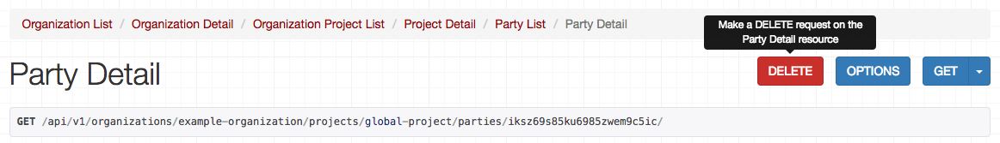
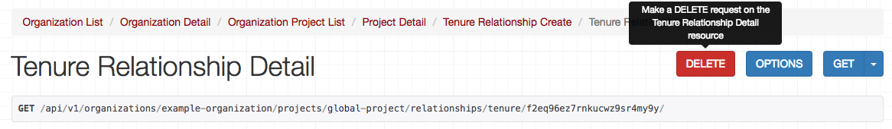

## Spatial Units (a.k.a Project Locations)

> Questions for Oliver:
* Should we call these Spatial Units or Project Locations? They're called Project Locations in the docs and on the platform, so I'm inclined to go that route. Are they called Spatial Units for a reason?


Projects in the Cadasta Platform are spatial in nature – collections of points, lines, and polygons representing areas where land rights documentation is happening. These points, lines, and polygons can be retrieved and modified using the Cadasta API.  

_<a href="https://docs.cadasta.org/en/04-records.html#project-locations" target="_blank">Read more about Project Locations in our Platform Documentation</a>_

The endpoint you need to access JSON for spatial units / project locations starts like this:

```
/api/v1/organizations/{organization_slug}/projects/{project_slug}/spatial/
```
> Oliver, is `geometry` an `array` or an `object`? Used `array` since `object` wasn't listed as a type literal.

A spatial unit / project location JSON object contains the following properties: 

Property | Type | Required? | Description
---|---|:---:|---
`type` | `String` | x | This field is automatically set to `Feature`.
`geometry` | `Array` | x | An object defining whether the location is recorded as a point, line, or polygon, as well as coordinates that make it up. (See the `geometry` table below for more information.)   
`properties` | `Array` | x | An object that gives the location a unique ID, defines the type of location it is (land `types`), and lists any attributes. (See  the `properties` table below for more information)

The `geometry` object contains the following properties: 

> Oliver, is `coordinates` an `Array` if it's only a single point?

Property | Type | Required? | Description
---|---|:---:|---
`type` |  `String` | x | Indicates the geometry type: a `Point`, `LineString`, or `Polygon`.
`coordinates` | `Array` | x | An array of all the GPS coordinates that make up the geometry of the spatial unit.

The `properties` object contains the following properties:

Property | Type | Required? | Description
---|---|:---:|---
`id` | `String` | x |  A unique ID for the spatial unit
`type` | `String` | x | The type of spatial unit that it is, defined by the fields in your questionnaire. (See the land `types` table below )
`attributes` | `Array` |  | An array of different attributes for the property. 
`project` | `Array` |  | An object containing basic information about the project, and within that, the organization. This field will not be present when working with a list of spatial units, as with `GET /api/v1/organizations/{organization_slug}/projects/{project_slug}/spatial/`. See the `project` table below for more information.

> Oliver, `attributes` looks like an object, but I don't see any listed as an example. How are these objects structured? 

The `project` object contains the following properties:

Property | Type | Required? | Description
---|---|:---:|---
`id` | `String` | x |  A unique ID for the project
`organization` | `Array` | x |  An object containing the organization `id`, `slug` and `name`. (See the `organization` table below.)
`name` | `String` | x |  The name of the project that the spatial unit is a project. 
`slug` | `String` | x |  The project slug.

Finally, the `organization` object contains the following properties:

Property | Type | Required? | Description
---|---|:---:|---
`id` | `String` | x |  A unique ID for the organization.
`slug` | `String` | x |  The organization slug.
`name` | `String` | x |  The name of the organization that's housing the project. 

**Land `type` Abbreviatiosn**

If you need to plot out the land `types`, these are the abbreviations you need:

Abbreviation | What it Represents
`PA` | Parcel
`CB` | Community Boundary
`BU` | Building
`AP` | Apartment
`PX` | Project Extent
`RW` | Right-of-way
`NP` | National Park Boundary
`MI` | Miscellaneous


#### Example Spatial Unit / Project Location JSON Object

```json

{
    "type": "Feature",
    "geometry": {
        "type": "Polygon",
        "coordinates": [
            [
                [
                    -122.66475677490233,
                    45.50045162361647
                ],
                [
                    -122.66956329345703,
                    45.487395598055215
                ],
                [
                    -122.66252517700195,
                    45.49954923075264
                ],
                [
                    -122.66475677490233,
                    45.50045162361647
                ]
            ]
        ]
    },
    "properties": {
        "id": "39jvd8r93jijahnvgd4s4cih",
        "type": "PA",
        "attributes": {},
        "project": {
            "id": "hxk4k8aee5rh5htahhh5uenn",
            "organization": {
                "id": "gae6pjf9xygxddgyg5dq45iq",
                "slug": "example-organization",
                "name": "Example Organization"
            },
            "name": "Portland Project",
            "slug": "portland-project"
        }
    }
}

```


### List Spatial Units / Project Locations

```endpoint
GET /api/v1/organizations/{organization_slug}/projects/{project_slug}/spatial/
```

Use the above method to get the GPS coordinates for all of the locations in a spatial unit / project location. These coordinates may be shown as a point, line or polygon.


**URL Parameters**

URL Parameter | Description
---|---
`organization_slug` | The slug provided for the organization, which can be found by locating the organization in the [list of all organzations](03-organization.md#user-content-list-organizations)
`project_slug` | The slug provided for the project, which can be found by [listing all of the projects in an organization](04-project.md#user-content-list-all-projects).

**Response**

> update links

The response body is a JSON object containing multiple [project location / spatial unit JSON objects](#user-content-example-spatial-units-in-a-project-aka-project-locations), only without the `project` property. 

Encasing these objects are the following properties:

Property | Type | Required? | Description 
--- | --- | :---: | --- 
`type` | `String` | x | This field is automatically set to FeatureCollection.
`features` | `Array`  | x | Creates an array of all of the [project location / spatial unit JSON objects](#user-content-example-spatial-units-in-a-project-aka-project-locations) in the project. 


####Example Response

```json
{
    "type": "FeatureCollection",
    "features": [
        {
            "type": "Feature",
            "geometry": {
                "type": "Polygon",
                "coordinates": [
                    [
                        [
                            -122.7457809448242,
                            45.64344809984393
                        ],
                        [
                            -122.7308464050293,
                            45.640807770704704
                        ],
                        [
                            -122.74543762207031,
                            45.64068775278732
                        ],
                        [
                            -122.7457809448242,
                            45.64344809984393
                        ]
                    ]
                ]
            },
            "properties": {
                "id": "xtc4de68iawwzgtawp8avgv8",
                "type": "PA",
                "attributes": {}
            }
        },
        {
            "type": "Feature",
            "geometry": {
                "type": "Polygon",
                "coordinates": [
                    [
                        [
                            -122.66475677490233,
                            45.50045162361647
                        ],
                        [
                            -122.66956329345703,
                            45.487395598055215
                        ],
                        [     [
                            -122.66252517700195,
                            45.49954923075264
                        ],
                        [
                            -122.66475677490233,
                            45.50045162361647
                        ]
                    ]
                ]
            },
            "properties": {
                "id": "39jvd8r93jijahnvgd4s4cih",
                "type": "PA",
                "attributes": {}
            }
        }
    ]
}
```


***


### Create a New Spatial Unit / Project Location


```endpoint
POST /api/v1/organizations/{organization_slug}/projects/{project_slug}/spatial/
```

Use the above method to create a new spatial unit / project location.

**Request Payload**

Property | Type | Required? | Description 
--- | --- | :---: | --- 
`geometry` | `Array` | x | An object defining whether the location is recorded as a `Point`, `Line`, or `Polygon`, as well as coordinates that make it up. (See the `geometry` table above for more information.)  
`type` | `String` | x | This refers to the possible land `types` that the location could be (e.g. `PA` = Parcel). See the **Land `type` Abbreviations**  table above for more information.
`attributes` | `Array` |  | An array of different attributes for the property. 

Formatting your geometry can be a little tricky. Here are some examples to help you out. 

To format a **point**, write:

```json
geometry: {"type": "Point", "coordinates": [-122.7457809448242, 45.64344809984393]}
```
> Oliver, is `LineString` the correct thing to use here? `Line` didn't work, but in the GeoJSON docs I found LineString

To format a **line**, write:

```json
"geometry": {"type": "LineString", "coordinates": [ [-122.7457809448242, 45.64344809984393 ], [-122.7457809448235, 45.64344809984393 ], [-122.7457809448219, 45.64344809984393 ] ] }
```

To format a **polygon**, write the following:

```json
"geometry": {"type": "Polygon", "coordinates": [ [ [-122.7457809448242, 45.64344809984393 ], [-122.7457809448235, 45.64344809984442 ], [-122.7457809448219, 45.64344809984999 ], [-122.7457809448242, 45.64344809984393 ] ] ] }

```

For polygons, make sure that the last coordinate is the same as the first.

Note that the main difference between the formatting examples above is the number of brackets, and the selection of `Point`, `LineString` or `Polygon` as the `type`.


**Response**

>Add link

The response is a spatial unit / project location JSON Object.

####Example Response

```json
{
    "type": "Feature",
    "geometry": {
        "type": "Point",
        "coordinates": [
            -122.7457809448242,
            45.64344809984393
        ]
    },
    "properties": {
        "id": "n776cwdhqriaqdwsfafiajib",
        "type": "MI",
        "attributes": {},
        "project": {
            "id": "hxk4k8aee5rh5htahhh5uenn",
            "organization": {
                "id": "gae6pjf9xygxddgyg5dq45iq",
                "slug": "example-organization",
                "name": "Example Organization"
            },
            "name": "Portland Project",
            "slug": "global-project"
        }
    }
}

```

***


### Get a Spatial Unit / Project Location

```endpoint
GET /api/v1/organizations/{organization_slug}/projects/{project_slug}/spatial/{spatial_unit_id}/
```

Use the above method to get the JSON object for a specific spatial unit / project location. 

The endpoint requires the `id` of the unit, which you can find by [listing all of the spatial units](#user-content-list-spatial-units) for the project it's in. The ID will look something like this:

```
"id": "39jvd8r93jijahnvgd4s4cih",
```

So the endpoint you need should look something like this:

```
/api/v1/organizations/example-organization/projects/global-project/spatial/39jvd8r93jijahnvgd4s4cih/
```

**Response**

The response contains a JSON object with the following structure:

> Not sure the type of field for `coordinates` and `properties`

> Also, for this, does it work to just have the outline rather than a table?

* `type`: ChoiceField (set automatically to `Feature`)
* `geometry`: GeometryField
    * `type`: ChoiceField (whether the feature is a `point`, `line `or `polygon`)
    * `coordinates` (the coordinates that make up the geometry)
* `properties`
    * `id`: CharField (the unique ID for the spatial unit / project location)
    * `type`: ChoiceField (the type of location it is; e.g. `PA` for Parcel)
    * `attributes`: ChoiceField (Optional)
    * `project`: NestedProjectSerializer
        * `id`: CharField (the ID of the project)
        * `organization`: OrganizationSerializer
            * `id`: CharField (the ID of the organization)
            * `slug`: SlugField (organization slug)
            * `name`: CharField (organization name)
        * `name`: CharField (project name)
        * `slug`: SlugField (project slug)


####Example Response

```json
{
    "type": "Feature",
    "geometry": {
        "type": "Polygon",
        "coordinates": [
            [
                [
                    -122.66475677490233,
                    45.50045162361647
                ],
                [
                    -122.66956329345703,
                    45.487395598055215
                ],
                [
                    -122.66252517700195,
                    45.49954923075264
                ],
                [
                    -122.66475677490233,
                    45.50045162361647
                ]
            ]
        ]
    },
    "properties": {
        "id": "39jvd8r93jijahnvgd4s4cih",
        "type": "PA",
        "attributes": {},
        "project": {
            "id": "hxk4k8aee5rh5htahhh5uenn",
            "organization": {
                "id": "gae6pjf9xygxddgyg5dq45iq",
                "slug": "example-organization",
                "name": "Example Organization"
            },
            "name": "Portland Project",
            "slug": "portland-project"
        }
    }
}
```

***


### Update a Spatial Unit

> Oliver, PATCH does not seem to be working with geometry / coordinates, only with `type`. Have not tried modifying `attributes`, as I'm not sure what goes there.

```endpoint
PATCH /api/v1/organizations/{organization_slug}/projects/{project_slug}/spatial/{spatial_unit_id}/
```

Use the above method to update the JSON object for a specific spatial unit / project location. 

The endpoint requires the `id` of the unit, which you can find by [listing all of the spatial units](#user-content-list-spatial-units) for the project it's in. The ID will look something like this:

```
"id": "39jvd8r93jijahnvgd4s4cih",
```

So the endpoint you need should look something like this:

```
/api/v1/organizations/example-organization/projects/global-project/spatial/39jvd8r93jijahnvgd4s4cih/
```

**Request Payload**

Property | Type | Required? | Description 
--- | --- | :---: | --- 
`geometry` | GeometryField | x | An object defining whether the location is recorded as a point, line, or polygon, as well as coordinates that make it up. (See the `geometry` table below for more information.)  
`type` | ChoiceField | x | This refers to the possible land `types` that the location could be (e.g. `PA` = Parcel). See the land `types` table above for more information.
`attributes` | JSONField |  | An array of different attributes for the property. 

Formatting your geometry can be a little tricky. Here are some examples to help you out. 

To format a **point**, write:

```json
geometry: {"type": "Point", "coordinates": [-122.7457809448242, 45.64344809984393]}
```
> Oliver, is `LineString` the correct thing to use here? `Line` didn't work, but in the GeoJSON docs I found LineString

To format a **line**, write:

```json
"geometry": {"type": "LineString", "coordinates": [ [-122.7457809448242, 45.64344809984393 ], [-122.7457809448235, 45.64344809984393 ], [-122.7457809448219, 45.64344809984393 ] ] }
```

To format a **polygon**, write the following:

```json
"geometry": {"type": "Polygon", "coordinates": [ [ [-122.7457809448242, 45.64344809984393 ], [-122.7457809448235, 45.64344809984442 ], [-122.7457809448219, 45.64344809984999 ], [-122.7457809448242, 45.64344809984393 ] ] ] }

```

For polygons, make sure that the last coordinate is the same as the first.

Note that the main difference between the formatting examples above is the number of brackets, and the selection of `Point`, `LineString` or `Polygon` as the `type`.

**Response**

The response contains a JSON object with the following structure:

> Not sure the type of field for `coordinates` and `properties`

> Also, for this, does it work to just have the outline rather than a table?

* `type`: ChoiceField (set automatically to `Feature`)
* `geometry`: GeometryField
    * `type`: ChoiceField (whether the feature is a `Point`, `LineString` or `Polygon`)
    * `coordinates` (the coordinates that make up the geometry)
* `properties`
    * `id`: CharField (the unique ID for the spatial unit / project location)
    * `type`: ChoiceField (the type of location it is; e.g. `PA` for Parcel)
    * `attributes`: ChoiceField (Optional)
    * `project`: NestedProjectSerializer
        * `id`: CharField (the ID of the project)
        * `organization`: OrganizationSerializer
            * `id`: CharField (the ID of the organization)
            * `slug`: SlugField (organization slug)
            * `name`: CharField (organization name)
        * `name`: CharField (project name)
        * `slug`: SlugField (project slug)


####Example Response

```json
{
    "type": "Feature",
    "geometry": {
        "type": "Polygon",
        "coordinates": [
            [
                [
                    -122.7457809448242,
                    45.64344809984393
                ],
                [
                    -122.7457809448235,
                    45.64344809984442
                ],
                [
                    -122.7457809448219,
                    45.64344809984999
                ],
                [
                    -122.7457809448242,
                    45.64344809984393
                ]
            ]
        ]
    },
    "properties": {
        "id": "w4rwh32mqctn9g223wnry2gx",
        "type": "PA",
        "attributes": {},
        "project": {
            "id": "hxk4k8aee5rh5htahhh5uenn",
            "organization": {
                "id": "gae6pjf9xygxddgyg5dq45iq",
                "slug": "example-organization",
                "name": "Example Organization"
            },
            "name": "Portland Project",
            "slug": "portland-project"
        }
    }
}

```

***


### Delete a Spatial Unit / Project Location

```endpoint
DELETE /api/v1/organizations/{organization_slug}/projects/{project_slug}/spatial/{spatial_unit_id}/
```

Use the above method to delete a spatial unit / project location.

Pressing the **Delete** button from the API UI will delete the member.

The endpoint requires the `id` of the unit, which you can find by [listing all of the spatial units](#user-content-list-spatial-units) for the project it's in. The ID will look something like this:

```
"id": "39jvd8r93jijahnvgd4s4cih",
```

So the endpoint you need should look something like this:

```
/api/v1/organizations/example-organization/projects/global-project/spatial/39jvd8r93jijahnvgd4s4cih/
```

**Response**

> Oliver, not sure if this is what's supposed to happen, but this is what happened.

If the deletion has properly occurred, then you should get a message like the following:

```
NOT FOUND

The requested URL /api/v1/organizations/example-organization/projects/global-project/spatial/w4rwh32mqctn9g223wnry2gx/ was not found on this server.
```

When you [list all the spatial units in the project](#user-content-list-spatial-units), the one you've just deleted should be gone.

Otherwise, you'll get an error message or one of these [common response codes](01-introduction.md#user-content-common-response-codes).

####Example Response

```
NOT FOUND

The requested URL /api/v1/organizations/example-organization/projects/global-project/spatial/w4rwh32mqctn9g223wnry2gx/ was not found on this server.
```


## Parties

Each project location has a relationship with people of all kinds – sometimes individuals, sometimes groups, and sometimes a corporation. These people are known as **parties** in the Cadasta system. 

_<a href="https://docs.cadasta.org/en/04-records.html#location-relationships" target="_blank">Read more about Parties in our Platform Documentation</a>_

Using the API, you can view, create, update, and delete parties for your project. 

```
/api/v1/organizations/{organization_slug}/projects/{project_slug}/parties/
```

> add in object structure?

***


### List Parties

```endpoint
GET /api/v1/organizations/{organization_slug}/projects/{project_slug}/parties/
```

Use the above method to return al of the parties listed as part of a project.


**Response**

The response is an array of all the parties listed as part of the project. Each party object contains the following properties:

Property | Type | Required? | Description 
--- | --- | :---: | --- 
`id` | CharField | x | The autogenerated unique ID for each party.
`name` | CharField | x | The name of the party.
`type` | ChoiceField | x | The type of party, indicating whether it's an individual (`IN`), a group (`GR`), or a corporation (`CO`).
`contacts` | JSONField |  | ??
`attributes` | JSONField |  | ??

> Oliver, `contacts` and `attributes` are both empty. Also, I don't see them as options for collecting data on the platform. Are these future features?

####Example Response

```json
[
    {
        "id": "ajnyj54mpma7kpexxejfv5he",
        "name": "Example Corp.",
        "type": "CO",
        "contacts": {},
        "attributes": {}
    },
    {
        "id": "cnpsvntqugkncywqevhznnsz",
        "name": "Joan Arches",
        "type": "IN",
        "contacts": {},
        "attributes": {}
    },
    {
        "id": "wvvi6sbgdf77nfwbe26fgz3z",
        "name": "Portland Islands Neighborhood Association",
        "type": "GR",
        "contacts": {},
        "attributes": {}
    }
]

```
***


### Create a New Party

```endpoint
POST /api/v1/organizations/{organization_slug}/projects/{project_slug}/parties/
```

Use the above method to create a new party.

**Request Payload**

Property | Type | Required? | Description 
--- | --- | :---: | --- 
`name` | CharField | x | The name of the party.
`type` | ChoiceField | x | The type of party, indicating whether it's an individual (`IN`), a group (`GR`), or a corporation (`CO`).
`contacts` | JSONField |  | ??
`attributes` | JSONField |  | ??

**Response**

The response contains a JSON object that's structured as follows:

* `id`: CharField (unique ID for the party)
* `name`: CharField (name of the party)
* `type`: ChoiceField (whether the party is an individual (`IN`), a group (`GR`), or a corporation (`CO`)
* `contacts`: JSONField
* `attributes`: JSONField
* `project`: NestedProjectSerializer
    * `id`: CharField (unique ID for the project)
    * `organization`: OrganizationSerializer
        * `id`: CharField (unique ID for the organization)
        * `slug`: SlugField (the organization slug)
        * `name`: CharField (the name of the organization)
    * `name`: CharField (the name of the project)
    * `slug`: SlugField (the project slug)


####Example Response

```json
{
    "id": "z8f83bt6fskq6wcvnp223t3q",
    "name": "Jane Doe",
    "type": "IN",
    "contacts": {},
    "attributes": {},
    "project": {
        "id": "hxk4k8aee5rh5htahhh5uenn",
        "organization": {
            "id": "gae6pjf9xygxddgyg5dq45iq",
            "slug": "example-organization",
            "name": "Example Organization"
        },
        "name": "Portland Project",
        "slug": "global-project"
    }
}

```

***


### Get a Party

```endpoint
GET /api/v1/organizations/{organization_slug}/projects/{project_slug}/parties/{party_id}/
```

Use the above method to get at a specific party. 

Using this method requires using the party ID, which you can find by [listing all of the parties](#user-content-list-parties). Find the party that you're looking for, and then identify the `id` field. It will look something like this:

```
"id": "z8f83bt6fskq6wcvnp223t3q",
```

Add the ID to the end of your endpoint, without quotes or commas, so that it reads something like this:

```endpoint
GET /api/v1/organizations/example-organization/projects/global-project/parties/z8f83bt6fskq6wcvnp223t3q/
```


**Response**

The response contains a JSON object that's structured as follows:

* `id`: CharField (unique ID for the party)
* `name`: CharField (name of the party)
* `type`: ChoiceField (whether the party is an individual (`IN`), a group (`GR`), or a corporation (`CO`)
* `contacts`: JSONField
* `attributes`: JSONField
* `project`: NestedProjectSerializer
    * `id`: CharField (unique ID for the project)
    * `organization`: OrganizationSerializer
        * `id`: CharField (unique ID for the organization)
        * `slug`: SlugField (the organization slug)
        * `name`: CharField (the name of the organization)
    * `name`: CharField (the name of the project)
    * `slug`: SlugField (the project slug)


####Example Response

```json
{
    "id": "z8f83bt6fskq6wcvnp223t3q",
    "name": "Jane Doe",
    "type": "IN",
    "contacts": {},
    "attributes": {},
    "project": {
        "id": "hxk4k8aee5rh5htahhh5uenn",
        "organization": {
            "id": "gae6pjf9xygxddgyg5dq45iq",
            "slug": "example-organization",
            "name": "Example Organization"
        },
        "name": "Portland Project",
        "slug": "global-project"
    }
}
```

***


### Update a Party

```endpoint
PATCH /api/v1/organizations/{organization_slug}/projects/{project_slug}/parties/{party_id}/
```

Use the above method to update the `name`, `type`, `contacts`, or `attributes` of a party.

Using this method requires using the party ID, which you can find by [listing all of the parties](#user-content-list-parties). Find the party that you're looking for, and then identify the `id` field. It will look something like this:

```
"id": "z8f83bt6fskq6wcvnp223t3q",
```

Add the ID to the end of your endpoint, without quotes or commas, so that it reads something like this:

```endpoint
GET /api/v1/organizations/example-organization/projects/global-project/parties/z8f83bt6fskq6wcvnp223t3q/
```

**Request Payload**

You can modify any one of these fields:

Property | Type  | Description 
--- | --- | --- 
`name` | CharField | The name of the party.
`type` | ChoiceField | The type of party, indicating whether it's an individual (`IN`), a group (`GR`), or a corporation (`CO`).
`contacts` | JSONField | ??
`attributes` | JSONField | ??


**Response**

The response contains a JSON object that's structured as follows:

* `id`: CharField (unique ID for the party)
* `name`: CharField (name of the party)
* `type`: ChoiceField (whether the party is an individual (`IN`), a group (`GR`), or a corporation (`CO`)
* `contacts`: JSONField
* `attributes`: JSONField
* `project`: NestedProjectSerializer
    * `id`: CharField (unique ID for the project)
    * `organization`: OrganizationSerializer
        * `id`: CharField (unique ID for the organization)
        * `slug`: SlugField (the organization slug)
        * `name`: CharField (the name of the organization)
    * `name`: CharField (the name of the project)
    * `slug`: SlugField (the project slug)


####Example Response

```json
{
    "id": "z8f83bt6fskq6wcvnp223t3q",
    "name": "Jane Doe",
    "type": "IN",
    "contacts": {},
    "attributes": {},
    "project": {
        "id": "hxk4k8aee5rh5htahhh5uenn",
        "organization": {
            "id": "gae6pjf9xygxddgyg5dq45iq",
            "slug": "example-organization",
            "name": "Example Organization"
        },
        "name": "Portland Project",
        "slug": "global-project"
    }
}

```

***


### Delete a Party

```endpoint
DELETE /api/v1/organizations/{organization_slug}/projects/{project_slug}/parties/{party_id}/
```

Use the above method and endpoint to delete a party. 

Pressing the **Delete** button from the API UI will delete the party.



Using this method requires using the party ID, which you can find by [listing all of the parties](#user-content-list-parties). Find the party that you're looking for, and then identify the `id` field. It will look something like this:

```
"id": "z8f83bt6fskq6wcvnp223t3q",
```

Add the ID to the end of your endpoint, without quotes or commas, so that it reads something like this:

```endpoint
GET /api/v1/organizations/example-organization/projects/global-project/parties/z8f83bt6fskq6wcvnp223t3q/
```


**Response**

> Oliver, not sure if this is what's supposed to happen, but this is what happened.

If the deletion has properly occurred, then you should get a message like the following:

```
NOT FOUND

The requested URL /api/v1/organizations/example-organization/projects/global-project/parties/iksz69s85ku6985zwem9c5ic/ was not found on this server.
```

When you [list all of the parties in the project](#user-content-list-parties), the one you've just deleted should be gone.

Otherwise, you'll get an error message or one of these [common response codes](01-introduction.md#user-content-common-response-codes).

####Example Response

```
NOT FOUND

The requested URL /api/v1/organizations/example-organization/projects/global-project/spatial/w4rwh32mqctn9g223wnry2gx/ was not found on this server.
```

***


## Relationships

Each location has a relationship with one or more parties, and each of those parties has a specific type of relationship with the land. For example, a municipal body may own a park, and a local tribe may have right-of-way access to it. Ownership and right-of-way-access are both types of relationships (which can also be referred to as tenure relationships).

_<a href="https://docs.cadasta.org/en/04-records.html#location-relationships" target="_blank">Read more about Relationships in our Platform Documentation</a>_

The Cadasta API allows you to both list relationships of a party and list relationships to a spacial unit / project location. You can get, create, update, and delete tenure relationships as well.

Endpoints in this section start with:

```
/api/v1/organizations/{organization_slug}/projects/{project_slug}/parties/{party_id}/relationships/
```

or

```
/api/v1/organizations/{organization_slug}/projects/{project_slug}/spatial/{spatial_unit_id}/relationships/
```

or

```
/api/v1/organizations/{organization_slug}/projects/{project_slug}/relationships/tenure/{relationship_id}/
```

> add object overview?

###Tenure Categories

Tenure relationships fall into one of the following categories. The abbreviations on the left are what you'd use when modifying or reading a tenure relationship using the API:

Abbreviation | What it Represents
---|---
AL | All Types
CR | Carbon Rights
CO | Concessionary Rights
CU | Customary Rights
EA | Easement
ES | Equitable Servitude
FH | Freehold
GR | Grazing Rights
HR | Hunting/Fishing/Harvest Rights
IN | Indigenous Land Rights
JT | Joint Tenancy
LH | Leasehold
LL | Longterm leasehold
MR | Mineral Rights
OC | Occupancy (No Documented Rights)
TN | Tenancy (Documented Sub-lease)
TC | Tenancy in Common
UC | Undivided Co-ownership
WR | Water Rights


***


### List Relationships of a Party to Spatial Units / Project Locations

> Currently this method returns an empty array; fill in when it's working.

```endpoint
GET /api/v1/organizations/{organization_slug}/projects/{project_slug}/parties/{party_id}/relationships/
```

One party may have relationships with many locations. But which ones? Use the above method to find out.

Using this method requires using the party ID, which you can find by [listing all of the parties](#user-content-list-parties). Find the party that you're looking for, and then identify the `id` field. It will look something like this:

```
"id": "z8f83bt6fskq6wcvnp223t3q",
```

Add the ID to the end of your endpoint, without quotes or commas, so that it reads something like this:

```endpoint
GET /api/v1/organizations/example-organization/projects/portland-project/parties/ajnyj54mpma7kpexxejfv5he/relationships
```

**Request Payload**

> fill in

Property | Type | Required? | Description 
--- | --- | :---: | --- 
`thing` | CharField | x | words

**Response**

> fill in

####Example Response

> fill in

***


### List Relationships to a Spatial Unit

```endpoint
GET /api/v1/organizations/{organization_slug}/projects/{project_slug}/spatial/{spatial_unit_id}/relationships/
```

One spatial unit may have relationships with many parties. But which ones? Use the above method to find out.

This method requires using the spatial unit / project location ID, which you can find by [listing all of the spatial units / project locations in a project](#user-content-list-spatial-units--project-locations). Find the spatial unit that you're looking for, and then identify the `id` field in the `properties` object. It will look something like this:

```
"id": "xtc4de68iawwzgtawp8avgv8",
```

Add the ID to the end of your endpoint, without quotes or commas, so that it reads something like this:

```endpoint
GET /api/v1/organizations/example-organization/projects/global-project/spatial/xtc4de68iawwzgtawp8avgv8/relationships/
```

**Response**

The response is a JSON Object with an array of spatial relationship objects, which have the following structure: 

* `rel_class` (automatically defined as `tenure`)
* `id`: CharField (the ID of the relationship)
* `party` (the object containing the party that the spatial unit is related to)
    * `id`: CharField(the ID of the party)
    * `name`: CharField (the name of the party)
    * `type`: ChoiceField (the type of party; an individual (`IN`), a group (`GR`), or a corporation (`CO`).)
* `spatial_unit` (the spatial unit / project location object)
    * `type`: ChoiceField (automatically set to `Feature`)
    * `geometry`: GeometryField
        * `type`: ChoiceField (whether the feature is a `Point`, `LineString` or `Polygon`)
        * `coordinates` (the coordinates that make up the geometry)
    * `properties`
        * `id`: CharField (unique ID of the spatial unit / project location)
        * `type`: ChoiceField (the kind of property it is; e.g. `PA` = Parcel)
* `tenure_type`: ChoiceField (the kind of relationship; see the Tenure Relationship table for more information)
* `attributes`: JSONField (an array of attributes)

> add link to Tenure Relationship table when live


####Example Response

```json
[
    {
        "rel_class": "tenure",
        "id": "mmikx24rcjd2stgyqz495fqa",
        "party": {
            "id": "wvvi6sbgdf77nfwbe26fgz3z",
            "name": "Portland Islands Neighborhood Association",
            "type": "GR"
        },
        "spatial_unit": {
            "type": "Feature",
            "geometry": {
                "type": "Polygon",
                "coordinates": [
                    [
                        [
                            -122.7457809448242,
                            45.64344809984393
                        ],
                        [
                            -122.7308464050293,
                            45.640807770704704
                        ],
                        [
                            -122.74543762207031,
                            45.64068775278732
                        ],
                        [
                            -122.7457809448242,
                            45.64344809984393
                        ]
                    ]
                ]
            },
            "properties": {
                "id": "xtc4de68iawwzgtawp8avgv8",
                "type": "PA"
            }
        },
        "tenure_type": "TN",
        "attributes": {}
    },
    {
        "rel_class": "tenure",
        "id": "f2eq96ez7rnkucwz9sr4my9y",
        "party": {
            "id": "ajnyj54mpma7kpexxejfv5he",
            "name": "Example Corp.",
            "type": "CO"
        },
        "spatial_unit": {
            "type": "Feature",
            "geometry": {
                "type": "Polygon",
                "coordinates": [
                    [
                        [
                            -122.7457809448242,
                            45.64344809984393
                        ],
                        [
                            -122.7308464050293,
                            45.640807770704704
                        ],
                        [
                            -122.74543762207031,
                            45.64068775278732
                        ],
                        [
                            -122.7457809448242,
                            45.64344809984393
                        ]
                    ]
                ]
            },
            "properties": {
                "id": "xtc4de68iawwzgtawp8avgv8",
                "type": "PA"
            }
        },
        "tenure_type": "LL",
        "attributes": {}
    },
    {
        "rel_class": "tenure",
        "id": "5ueeskcsfgf4iuwcgmji3dik",
        "party": {
            "id": "cnpsvntqugkncywqevhznnsz",
            "name": "Joan Arches",
            "type": "IN"
        },
        "spatial_unit": {
            "type": "Feature",
            "geometry": {
                "type": "Polygon",
                "coordinates": [
                    [
                        [
                            -122.7457809448242,
                            45.64344809984393
                        ],
                        [
                            -122.7308464050293,
                            45.640807770704704
                        ],
                        [
                            -122.74543762207031,
                            45.64068775278732
                        ],
                        [
                            -122.7457809448242,
                            45.64344809984393
                        ]
                    ]
                ]
            },
            "properties": {
                "id": "xtc4de68iawwzgtawp8avgv8",
                "type": "PA"
            }
        },
        "tenure_type": "WR",
        "attributes": {}
    }
]
```

***


### Create a New Tenure Relationship

> Not sure how to format this to get it to work. Also, `attributes` may not be left blank, but I haven't seen an example of what goes into that field...

```endpoint
POST /api/v1/organizations/{organization_slug}/projects/{project_slug}/relationships/tenure/
```

**Request Payload**

> fill in 

Property | Type | Required? | Description 
--- | --- | :---: | --- 
`thing` | CharField | x | words

**Response**

> fill in

####Example Response

> fill in

***


### Get a Tenure Relationship

```endpoint
GET /api/v1/organizations/{organization_slug}/projects/{project_slug}/relationships/tenure/{relationship_id}/
```

Use the above method and endpoint to get a specific tenure relationship. 

Doing this requires finding the relationship ID, which can be found from [listing all of the relationships to a spatial unit](user-content-list-relationships-of-a-spatial-unit). 

The ID can be found towards the top of the relationship object, just below the `rel_class` field. It looks something like this:

```
"id": "f2eq96ez7rnkucwz9sr4my9y",
```

Add this ID – without any quotation marks, commas, spaces or other characters – to the end of the endpoint, so that it reads something like this:

```endpoint
GET /api/v1/organizations/example-organization/projects/global-project/relationships/tenure/f2eq96ez7rnkucwz9sr4my9y/

```

**Request Payload**

There's no request payload; only a properly formatted endpoint. 

**Response**

The response is a JSON Object with an array of spatial relationship objects, which have the following structure: 

* `rel_class` (automatically defined as `tenure`)
* `id`: CharField (the ID of the relationship)
* `party` (the object containing the party that the spatial unit is related to)
    * `id`: CharField(the ID of the party)
    * `name`: CharField (the name of the party)
    * `type`: ChoiceField (the type of party; an individual (`IN`), a group (`GR`), or a corporation (`CO`).)
* `spatial_unit` (the spatial unit / project location object)
    * `type`: ChoiceField (automatically set to `Feature`)
    * `geometry`: GeometryField
        * `type`: ChoiceField (whether the feature is a `Point`, `LineString` or `Polygon`)
        * `coordinates` (the coordinates that make up the geometry)
    * `properties`
        * `id`: CharField (unique ID of the spatial unit / project location)
        * `type`: ChoiceField (the kind of property it is; e.g. `PA` = Parcel)
* `tenure_type`: ChoiceField (the kind of relationship; see the Tenure Relationship table for more information)
* `attributes`: JSONField (an array of attributes)


####Example Response

```json
{
    "rel_class": "tenure",
    "id": "f2eq96ez7rnkucwz9sr4my9y",
    "party": {
        "id": "ajnyj54mpma7kpexxejfv5he",
        "name": "Example Corp.",
        "type": "CO"
    },
    "spatial_unit": {
        "type": "Feature",
        "geometry": {
            "type": "Polygon",
            "coordinates": [
                [
                    [
                        -122.7457809448242,
                        45.64344809984393
                    ],
                    [
                        -122.7308464050293,
                        45.640807770704704
                    ],
                    [
                        -122.74543762207031,
                        45.64068775278732
                    ],
                    [
                        -122.7457809448242,
                        45.64344809984393
                    ]
                ]
            ]
        },
        "properties": {
            "id": "xtc4de68iawwzgtawp8avgv8",
            "type": "PA"
        }
    },
    "tenure_type": "LL",
    "attributes": {}
}

```


***


### Update a Tenure Relationship

> Not able to perform this method; getting errors that have to do with `spatial_unit` and `party`

```endpoint
PATCH /api/v1/organizations/{organization_slug}/projects/{project_slug}/relationships/tenure/{relationship_id}/
```

Use the above method and endpoint to update a tenure relationship.

Doing this requires finding the relationship ID, which can be found from [listing all of the relationships to a spatial unit](user-content-list-relationships-of-a-spatial-unit). 

The ID can be found towards the top of the relationship object, just below the `rel_class` field. It looks something like this:

```
"id": "f2eq96ez7rnkucwz9sr4my9y",
```

Add this ID – without any quotation marks, commas, spaces or other characters – to the end of the endpoint, so that it reads something like this:

```endpoint
GET /api/v1/organizations/example-organization/projects/global-project/relationships/tenure/f2eq96ez7rnkucwz9sr4my9y/
```


**Request Payload**

> Fill in 

Property | Type | Required? | Description 
--- | --- | :---: | --- 
`thing` | CharField | x | words

**Response**

> Fill in 

####Example Response

> Fill in 


***


### Delete a Relationship

```endpoint
DELETE /api/v1/organizations/{organization_slug}/projects/{project_slug}/relationships/tenure/{relationship_id}/
```

Use the above method to delete a relationship from a project.

Pressing the **Delete** button from the API UI will delete the relationship between the party and the spatial unit.



**Response**

> Oliver, not sure if this is what's supposed to happen, but this is what happened.

If the deletion has properly occurred, then you should get a message like the following:

```
NOT FOUND

The requested URL /api/v1/organizations/example-organization/projects/global-project/relationships/tenure/f2eq96ez7rnkucwz9sr4my9y/ was not found on this server.
```

Now, when you go to look at the relationships by either spatial unit or party, the two will not longer be linked.

Otherwise, you'll get an error message or one of these [common response codes](01-introduction.md#user-content-common-response-codes).

####Example Response

```
NOT FOUND

The requested URL /api/v1/organizations/example-organization/projects/global-project/relationships/tenure/f2eq96ez7rnkucwz9sr4my9y/ was not found on this server.
```

***


<!-- ### Create a new party

```endpoint
POST /api/v1/organizations/{organization_slug}/projects/{project_slug}/parties/
```

### Get a party

```endpoint
GET /api/v1/organizations/{organization_slug}/projects/{project_slug}/parties/{party_id}/
```

### Update a party

```endpoint
PATCH /api/v1/organizations/{organization_slug}/projects/{project_slug}/parties/{party_id}/
```

### Delete a party

```endpoint
DELETE /api/v1/organizations/{organization_slug}/projects/{project_slug}/parties/{party_id}/
```
 -->
